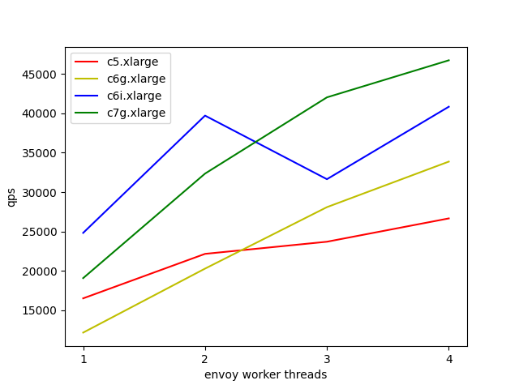

We did some load test internally, and here's the result:

| machine type | --concurrency 1 | --concurrency 2 | --concurrency 3 | --concurrency 4 |
| ------------ | --------------- | --------------- | --------------- | --------------- |
| c5.xlarge    |           16501 |           22153 |           23694 |           26657 |
| c6g.xlarge   |           12151 |           20279 |           28087 |           33873 |
| c6i.xlarge   |           24818 |           39716 |           31638 |           40844 |
| c7g.xlarge   |           19071 |           32349 |           42035 |           46742 |

Here's the setup:

* Zone usw2-az1 in us-west-2 (Oregon).

* A single c6i.8xlarge instance to run the load generator, the server sidecar proxy, and the dummy server.

* A c5/c6g/c6i/c7g.xlarge instance dedicated to run the client sidecar proxy.

* Envoy v1.25.2 for both the client sidecar proxy and the server sidecar proxy.

* Ubuntu 22.04, openjdk-19-jre-headless.

* The workload generated is beyond the capacity of the Envoy worker threads, such that backlog will form at the client sidecar proxy, to get the rps at max load.

* Command to start the dummy server: `./main -l 127.0.0.1:3000 -t Asia/Kuala_Lumpur`

* Command to start the server sidecar proxy: `envoy -c server.json --concurrency 4`

* Command to start the client sidecar proxy: `envoy -c client.json --concurrency $CONCURRENCY` (where $CONCURRENCY is set to 1, 2, 3, and 4)

* Command to start the load generator: `java -XX:+UseZGC -Dlog4j.configurationFile=log4j2.xml -jar grpc-get-jar-with-dependencies.jar -r 48000 -t 1024 -w 60 -s 120 -c $CONNECTIONS -e $CLIENT_IP_ADDRESS:60000` (where $CONNECTIONS is set to 2 x $CONCURRENCY, i.e. 2, 4, 6, and 8, so that the load generator will send traffic over 2 GRPC connections to each of the Envoy worker threads)

* For the c7g.xlarge --concurrency 4 load test, the commands above had to be modified slightly.

  * Initially, the server sidecar proxy became the bottleneck, so the load test had to be done again with `envoy -c server.json --concurrency 5`.

  * Next, the c6i.8xlarge instance became the bottleneck, as the dummy server was using too much cpu (it wasn't originally written for load test purpose). A flag was added for it to use the more efficient grpc-go server, and the load test had to be done again with `./main -l 127.0.0.1:3000 -t Asia/Kuala_Lumpur -m grpc`.

  * Then, the 48000 rps from `-r 48000` wasn't enough to create backlog at the client sidecar proxy, and so the load test had to be done again with `-r 60000`.

Some notes about the result:

* Intel has 2 very fast cores, but graviton has 4 physical cores that can do more.

* Hyper-threading does not seem to help much in this load test. The numbers are especially bad for c6i.xlarge.

* When running the load test, sometimes the qps number can fluctuate quite a bit, such that a test run can suddenly be 10-20% better/worse than an identical test run that happened 5 minutes ago.

  * While the numbers may not be easily/entirely reproducible, the patterns of the graph should still be the same.

  * For load test where the margin is smaller, e.g. to verify if a compiler flag helps, the fluctuation can quite easily lead to false positive/negative.

  * The load generator was originally written to stress test MySQL running on GCE machines. At that time, the qps number would only fluctuate for identical test runs when the machines were stopped/started via API, such that they ended up on different physical machines that might be faster or slower. Here, the same EC2 machines stayed up all the time, and yet the fluctuation was worse. Noisy neighbors?
